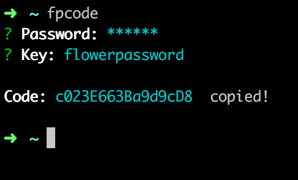

# flower-password-cli
The FlowerPassword.js command line utility.



## Installation

```
$ npm install -g flower-password-cli
```


## Update

```
$ npm update -g flower-password-cli
```


## Usage

```
$ fpcode -h
```


# License

MIT
